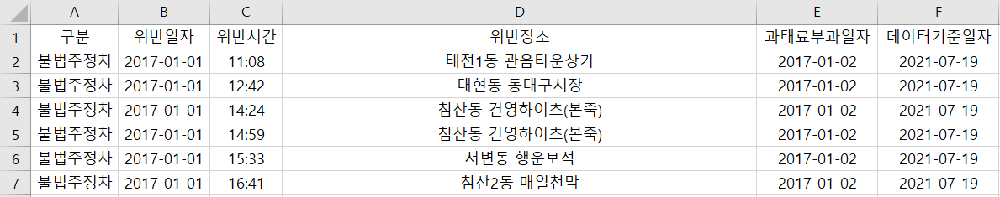
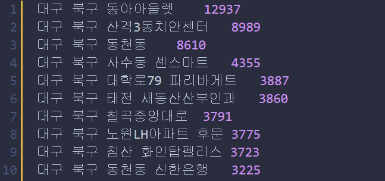
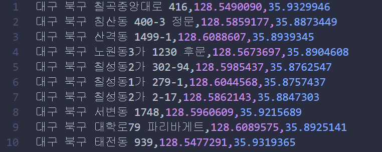
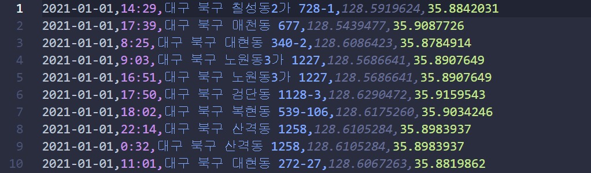

# 1. 개요

본 프로젝트는 21년도 하계 범일정보 현장실습 기간동안 진행

- 기간 : 21/07/19 ~ 21/08/13
- 목표 : ELK Stack을 사용하여 공공데이터 분석 및 시각화
- 내용 : 북구청 불법주정차 데이터셋과 기타 위치정보 데이터를 이용하여 유의미한 결과 분석

# 2. 진행

## 1) 학습

ELK Stack에 대한 지식이 1도 없었기 때문에 7/19 ~ 7/23 기간동안 공부했다.
- <a href="https://github.com/dogyun-k/ELK-Stack/blob/main/studies/Logstash.md">Logstash 이론 및 실습해보기!</a>

- <a href="https://github.com/dogyun-k/ELK-Stack/blob/main/studies/Elasticsearch.md">Elasticsearch 이론 및 실습해보기!</a>

## 2) 프로젝트 진행

공공데이터셋(csv) -> 데이터 전처리(Python) -> 데이터 수집(Filebeat) -> 필터링(Logstash) -> 저장(Elasticsearch) -> 시각화(Kibana)

### 데이터
북구청에서 제공하는 `북구청 불법주정차 현황` 데이터와 기타 시설 위치데이터를 사용했다.

- 데이터 구성

    

필요한 데이터는 날짜, 시간, 위치정보이며 위치정보는 주소로 되어있어 나중에 시각화를 위해서 좌표데이터가 필요했다.

### 전처리

`북구청 불법주정차 현황` 데이터는 2017년도부터 2021년 6월까지의 데이터를 가지고 있었고, 유의미한 데이터 분석을 위해 21년도 데이터만 사용하기로 했다. (현재 존재하는 시설물 정보를 가지고 분석할거기 때문)

- 년도 별로 데이터 파싱

    ```py
    def split_data_into_date(split_year):
        """초기 데이터셋 (illegal_park_info.csv) 해당 년도 파일 저장."""

        with open('./illegal_park_info.csv', 'r', encoding='utf-8') as f:
            reader = csv.reader(f)

            csv_file = open(split_year+'_origin.csv', 'w', newline='', encoding='utf-8-sig')
            writer = csv.writer(csv_file)

            for row in reader:
                # print(row)
                year = row[1][:4]
                if year == split_year:
                    writer.writerow(row)
    ```

    21년도 데이터만 뽑아서 `2021_origin.csv`파일로 저장한다.

    데이터는 약 5만개

해당 주소의 좌표값을 얻기 위해 네이버맵 API를 사용했다.

- 네이버맵 API geocode로 좌표값 가져오기

    ```py
    def get_geocode(address):
        """네이버 API로 주소 -> 좌표 리턴"""

        url = "https://naveropenapi.apigw.ntruss.com/map-geocode/v2/geocode?"
        client_id = "<ID>"
        client_secret = "<SECRET>"
        query = "query=" + address
        header = {
            "X-NCP-APIGW-API-KEY-ID": client_id,
            "X-NCP-APIGW-API-KEY": client_secret
        }

        r = requests.get(url + query, headers=header)
        result = r.json()
        # print(result)

        if r.status_code == 200:
            if result['meta']['totalCount'] != 0:
                long, lat = result['addresses'][0]['x'], result['addresses'][0]['y']
                return long, lat
            else:
                return None
        else:
            # print("Error :", r.status_code)
            return False
    ```
    
    주소 검색이 되고 좌표값이 있다면 좌표값 리턴, 해당 주소에 대한 정보가 없으면 None 리턴

원데이터셋에 중복된 주소가 많아 나중에 API호출하여 좌표값을 얻을 때 시간이 많이 걸릴 것 같아 중복주소를 처리해주고 빈도수와 함께 저장했다.

- 중복 주소 처리 후 빈도수 기록

    ```py
    def remove_overlap(file_name):
        """origin 데이터셋에 중복되는 주소들 제거 후 주소, 빈도수 txt로 저장"""

        origin_file = open(file_name+'.csv', 'r', encoding='utf-8-sig')
        result_file = open(file_name+'.txt', 'w', encoding='UTF-8')
        reader = csv.reader(origin_file)
        
        addresses = {}
        
        for row in reader:
            print(row)
            if not row[addr] in addresses:
                addresses[row[addr]] = 1
            else:
                addresses[row[addr]] += 1
        
        origin_file.close()

        addresses = dict(sorted(addresses.items(), key=lambda x: x[1], reverse=True))

        # print(addresses)
        for key, value in addresses.items():
            if value >= 10:
                key = normalization(key)

                result_file.write(f"{key}\t{value}\n")
    ```

    

그리고 해당 데이터로 좌표값을 얻어봤다.

여기서 문제가 발생했다.

검색되지 않는 주소가 생각보다 많아서 손실데이터가 컸다.

우선 검색되지 않는 주소를 추출하여 전처리해야할 단어들을 파악했다.

해당 주소를 담은 API를 호출하여 확인했다.

- 검색되지 않는 주소 추출

    ```py
    def check_ok(file_name):
        """검색 안 되는 주소 리스트 뽑기"""

        f = open(file_name+'.txt', 'r', encoding='utf-8-sig')
        result = open(file_name+'_checked.csv', 'w', newline='', encoding='utf-8-sig')

        writer = csv.writer(result)

        ok_lists = []
        no_lists = []

        cnt = 0

        for row in f.readlines():
            row = row.strip()
            addr, number = row.split('\t')
            
            response = get_geocode(addr)

            if response != False:
                if response != None:
                    ok_lists.append(['ok', addr, response[0], response[1], number])
                else:
                    no_lists.append(['no', addr, number])
            else:
                no_lists.append(addr)

            print(f"\t{cnt}..... {(cnt / 3884)*100} %\t\t", end='\r')
            cnt += 1

        writer.writerows(no_lists)

        f.close()
        result.close()    
    ```

    파일 결과를 확인해보니 불필요한 단어들을 포함(건너, 부근 등)한 주소, 정확한 주소지가 아닌 것(동아백화점 뒤편)들 등등에서 문제가 발생했다.

    해당 데이터의 개수가 적으면 약간의 손실을 감안하고 진행해도 됐지만 전체주소 약 4천개 중 700여개의 주소가 검색되지 않았다.

데이터 손실을 줄이기 위해 불필요한 단어들을 포함(건너, 부근 등)한 주소를 처리해주었다.

- 주소 정규화

    ```py
    def normalization(address):
        """검색 안되는 주소 전처리"""

        # 앞뒤 공백 지우기
        address = address.strip()

        # 첫 단어가 "북구"라면 제거
        if address[:2] == "북구":
            address = address[3:]
        
        address = "대구 북구 " + address

        # 검색에 방해되는 단어 지우기
        ban_words = ["뒤편", "부근", "건너", "사거리", "사거", "횡단보도", "횡단번호", "모퉁이", "소화전", "육교밑", "버스정류장", "버스정류", "어린이보호구역", "인도"]
        for word in ban_words:
            address = re.sub(word, '', address)

        # 끝 단어 이상한거 제거
        last_bad_word = ['부', '소', '장', '앞']
        if address[-1] in last_bad_word:
            address = address[:-1]

        # 괄호 단어 지우기
        address = re.sub(r'\([^)]*\)', '', address)
        address = address.strip()

        # 도로명 주소와 구주소 합쳐진 주소를 도로명으로 통일
        address = gil_to_doro(address)

        return address
    ```

    ```py
    def gil_to_doro(addr):
        ### 동과 도로명 주소가 같이 있다면 제거함
        
        temp = addr.split(' ')
        
        if len(temp) < 4:
            return addr

        if temp[2][-1] == "동" or temp[2][-1] == "가":
            if temp[3][-1] == "로" or temp[3][-1] == "길":
                del temp[3]

        # print(temp)
        return " ".join(temp)
    ```

불필요 단어 제거 후 다시 검색되지 않는 주소를 추출해보니 빌딩명, 학교명 등 명칭으로만 저장된 주소와 지번만 적혀 검색이 되지 않는 주소들이 270개 남았다. 

여기서 빈도수 10개 이상 주소(약 100개)는 주소값을 직접 입력해주었다.

그리고나서 해당 주소들의 좌표값을 저장했다.

- 주소 좌표값을 저장

    ```py
    def make_geo_list_csv(file_name):

        input_file = open(file_name+'.txt', 'r', encoding='utf-8')
        output_file = open(file_name+'_geo.csv', 'w', newline='', encoding='utf-8-sig')

        writer = csv.writer(output_file)

        lists = []
        cnt = 0
        for row in input_file.readlines():
            address = row.split('\t')[0]
            geo_point = get_geocode(address)

            if geo_point != None:
                lists.append([address] + list(geo_point))
            else:
                print(address)

            cnt += 1 

        writer.writerows(lists)

        input_file.close()
        output_file.close()
    ```

    좌표 리스트는 아래와 같이 나왔다.

    

이제 원 데이터에 해당 좌표값을 추가하였다.

- 원데이터에 좌표값 추가

    ```py
    def complete(file_name):
        """csv 파일 읽어서 주소 전처리 + 좌표값 입력"""

        geo_file = open(file_name+'_geo.csv', 'r', encoding='utf-8-sig')
        origin_file = open(file_name+'_origin.csv', 'r', encoding='utf-8-sig')
        reulst_file = open(file_name+'.csv', 'w', newline='', encoding='utf-8-sig')
        
        origin_reader = csv.reader(origin_file)
        geo_reader = csv.reader(geo_file)
        writer = csv.writer(reulst_file)


        # 파일 불러와서 딕셔너리 저장해놓고 쓰는게 더 빠름. 딕셔너리 서치 O(1)
        geo_dict = {}
        for row in geo_reader:
            geo_dict[row[0]] = [row[1], row[2]]


        lists = []
        cnt = 0
        total = 49447

        for row in origin_reader:
            # print(row)
            row[addr] = normalization(row[addr])

            if row[addr] in geo_dict:
                geo_point = geo_dict[row[addr]]
                lists.append(row[1:4] + geo_point)
                print(row[1:4] + geo_point)

            print(f"{(cnt / total) * 100} %\t{cnt}\t", end='\r')
            cnt += 1

            if cnt % 1000 == 0:
                writer.writerows(lists)
                lists = []
        
        geo_file.close()
        origin_file.close()
        reulst_file.close()    
    ```

이렇게 전처리가 끝났다.

- 최종 데이터 셋 구성

    


# 3. 어려웠던 점

주소 처리